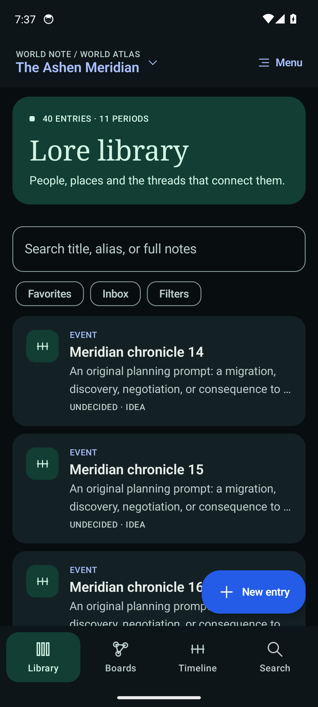
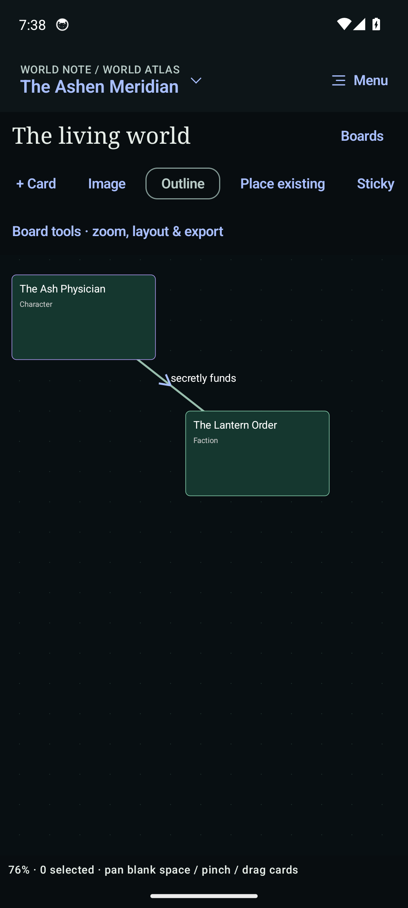
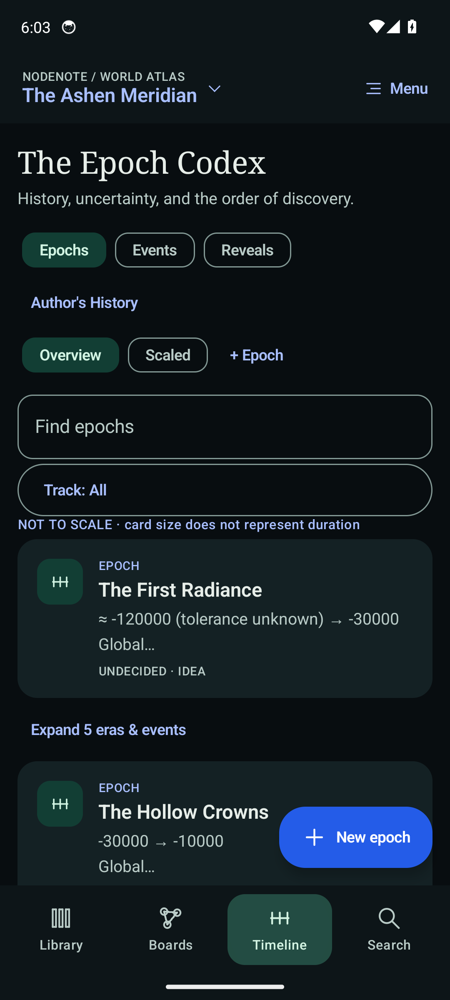

# NodeNote Worldbuilder

**An offline Android notebook for worlds with interconnected people, places and history.**

Write lore once, reuse it on visual boards, explain relationships, and organize ancient history without making up dates you do not know.

**Native Kotlin + Jetpack Compose · Room/SQLite · Android 14 tested · Current test version: 0.2.1**

  
  
  

*Actual Android 14 emulator captures using the original sample world. The interface uses cobalt, black and phthalo green, with a light theme available.*

## What it does

| Area | What you can do |
|---|---|
| **Lore library** | Write long Markdown notes for characters, places, factions, powers, creatures and other entries. Add aliases, tags, templates, links and media. |
| **Visual boards** | Reuse the same entry across boards. Pan, zoom, group and connect cards. Import images and choose which cards show notes, covers, tags and status. |
| **Relationships** | Give a relationship its own notes and validity period; reuse it without tying its identity to one drawing. |
| **Epoch Codex** | Organize epochs, eras and events with exact, approximate, ranged, relative, order-only or unknown dates. Keep overlapping histories readable. |
| **Stories and secrets** | Separate historical events from chapter reveals, author truth, public accounts and explicit character knowledge. |
| **Recovery and portability** | Autosave drafts, retain revisions and trash, export readable Markdown, and restore complete versioned backups with original images. |

Everything essential works locally. The app has **no account, ads, analytics or INTERNET permission**. A document provider you choose may itself use the network.

## Start here

1. Create a world, or choose **Explore sample world** to explore *The Ashen Meridian*.
2. Add an entry in **Library** and write its notes.
3. Open **Boards → Place existing** to reuse that entry. On a board, **Image** imports a picture; select a card and choose **Card content** to show its image, note preview, tags and status.
4. Use **Timeline** to open the Epoch Codex and organize history.
5. Make a **Complete workspace backup** in **Menu → Settings & backup**.

Wait for **Saved** before deliberately closing the app. Backups contain readable private lore; store them somewhere you control.

**[User guide](docs/USER_GUIDE.md) · [Build guide](docs/BUILDING.md) · [What is where](docs/REPOSITORY_MAP.md) · [Backup format](docs/BACKUP_FORMAT.md)**

## Build and install

### Download the APK

**[Download NodeNote 0.2.1 for Android](https://github.com/Fegi176/NodeNote/releases/download/v0.2.1/NodeNote-Worldbuilder-0.2.1.apk)** · [Release notes](https://github.com/Fegi176/NodeNote/releases/tag/v0.2.1)

Open the APK on your phone to install. This is a signed test release for Android 14. Android may ask you to allow installation from your browser or file manager. Install updates over the existing app to keep your data. Downloads require repository access while this repository is private.

### Build from source

Requirements: **JDK 17**, Android SDK **platform 36**, **build-tools 35.0.0**, and platform-tools. Android 14 is the verified phone/runtime target; compile SDK 36 does not require an Android 16 phone.

~~~powershell
git clone https://github.com/Fegi176/NodeNote.git
cd NodeNote
# Configure JAVA_HOME and ANDROID_HOME for your installed toolchain.
./gradlew.bat :core:test :app:lintDebug :app:assembleDebug
~~~

On macOS/Linux, use `./gradlew`. The pinned Gradle wrapper is included.

APK output: `app/build/outputs/apk/debug/app-debug.apk`

~~~text
adb -s YOUR_PHONE_SERIAL install -r app/build/outputs/apk/debug/app-debug.apk
~~~

The test package is `app.nodenote.worldbuilder.debug`, separate from the old `app.nodenote` prototype. Updates require the same signing certificate. **Never uninstall the writing app to work around a signing mismatch.** Locally and CI-generated debug keys can differ from the APK already installed on a phone.

Source is tracked here; generated APKs, local source bundles and raw device logs are kept outside Git. GitHub Actions is configured to upload build outputs and reports after a run. See the [build and test guide](docs/BUILDING.md) for emulator tests, isolated QA, packaging and troubleshooting.

## Project map

| Path | Responsibility |
|---|---|
| [app/](app/) | Android activity, Compose screens, ViewModel, Room repository, media and device tests |
| [core/](core/) | Platform-independent model, chronology, graph math, validation and archive/interchange formats |
| [app/schemas/](app/schemas/) | Versioned Room database schemas |
| [scripts/](scripts/) | Build checks, packaging, installation and dedicated-emulator smoke checks |
| [docs/](docs/) | User guide, build instructions, architecture, code map and backup format |
| [.github/workflows/android.yml](.github/workflows/android.yml) | GitHub build/lint/test workflow with optional Android 14 instrumentation |

## Working on the project

Start with [architecture](docs/ARCHITECTURE.md) and [contributing](CONTRIBUTING.md). Preserve separate lore/placement identities, transactional writes, unknown chronology and complete backup compatibility.

See the [changelog](CHANGELOG.md) for release changes.
