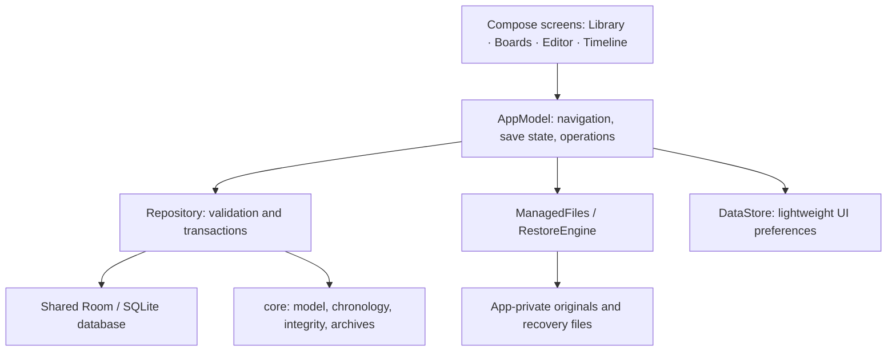

# Architecture

## One world, several independent views

The same character can appear on several boards, have different historical states, and be mentioned by a public account. Those views reference one stable lore identity; they do not own duplicate copies of its prose.

## App and core

- **core** is a pure Kotlin JVM module. It defines record kinds and references, year expressions and resolution, geometry, archive validation, import/export and public projections. These rules can be tested without Android.
- **app** supplies Compose screens, lifecycle/ViewModel state, DataStore preferences, Room persistence and Android document/image APIs.
- The app never requires a network service. The system picker mediates imports/exports; a selected provider has its own behavior.

See the [repository map](REPOSITORY_MAP.md) for concrete files.

## Identity and persistence

Room is authoritative. A normalized registry stores typed records plus scalar fields, ordered references and temporal expressions; it is not a serialized whole-world blob. UUIDs identify worlds, lore, placements, relationships and secondary records independently.

Repository owns production writes, validates world/type references and uses transactions. One process-wide Room instance and writer mutex avoid competing activity-owned connections. Selected-world observations reuse unchanged immutable records; process-local generations tell observers which normalized children need reloading.

Do not bypass Repository for ordinary mutations: raw DAO writes can leave incremental observation/search state stale. DAO-level access is reserved for migration/test setup.

Database schema version (2), archive format version (1) and application version are separate compatibility decisions. Room stores worlds, typed records, scalar fields, ordered references and temporal expressions in separate tables, with a derived FTS4 search index. Keep exported schemas in `app/schemas/` and provide explicit migrations for schema changes.

## Editing and board operations

An editor's recoverable draft precedes canonical save/validation. Save sequencing controls the visible acknowledgement; failed/conflicting writes preserve recovery options. Revisions are explicit checkpoints.

Gesture frames stay in memory until a board command is committed. Placement coordinates, size, color and image/note display flags belong to the placement. Lore prose and relationship explanations remain shared. Board undo applies to local graph state; removing a placement cannot delete its lore.

Image import validates/copies an original into private storage, then inserts its lore/media/placement transactionally. Canvas thumbnails are bounded and decoded off the UI thread. Full original bytes remain available for backup.

## Chronology and knowledge

Chronology expressions retain their uncertainty and anchor identities. Resolution/diagnostics do not silently replace unknown dates with exact coordinates. Overview layout and numeric scaled layout serve different reading tasks.

Story reveal order, author truth, explicit character knowledge and recorded public accounts remain separate models. Public export uses an allowlisted projection of selected prose; there is no fallback to private canonical prose or captions.

Fictional years use signed 64-bit integers, serialized as decimal strings. Present is an authored coordinate and does not follow the phone clock. Periods use half-open intervals `[start, end)`; occurrence ranges describe uncertainty, not duration. Relative dates preserve their anchor references. Resolution checks overflow, missing/cyclic anchors and contradictory ordering, while order-only records remain undated.

## Restore and recovery

A complete archive is inspected before mutation. Original images are staged/promoted with a recovery journal; database insertion/replacement is transactional. Replacement first produces a verified safety archive. Startup journal recovery resolves interrupted file promotion against committed attachment identities.

See [backup format](BACKUP_FORMAT.md) for archive structure, validation and import limits.
